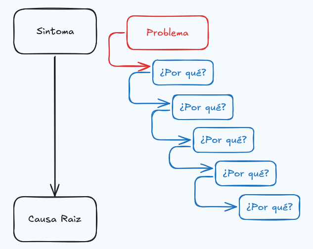
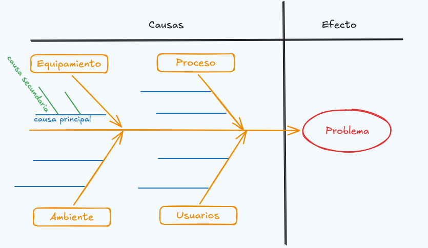
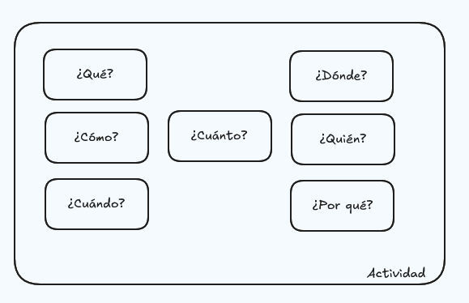
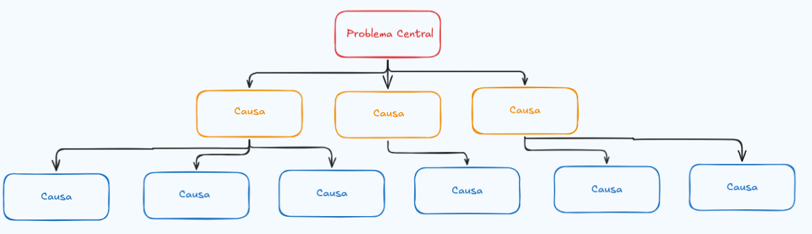
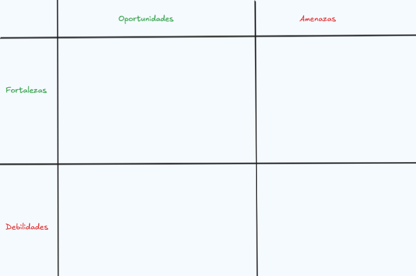

# Técnicas para el planteamiento de problemas

Para resolver problemas, es muy importante antes poder identificar y entender las causas que lo provocan ya que esto permite acotarlo y definirlo claramente. Identificar problemas requiere de estructura, analisis y colaboración para lograr distinguir los sintomas de una causa raíz.

Para resolver problemas existen diferentes técnicas, por ejemplo:

- **Five Whys**: La técnica de los 5 por qué, es una técnica interrogativa usada para explorar las relaciones entre las causas y efector de un problema particular.

    El objetivo de este método es determinar la causa raíz del problema a través de 5 iteraciones con la pregunta ¿por qué?.

    

- **Diagrama de Ishikawa**: Es un diagrama causal que muestra las potenciales causas de un evento especifico y su efecto. Esta es una de las herramientas más usadas para la gestión de calidad.

    Este diagrama permite identificar muchas posibles causas de un problema, ordenandolas dentro de categorias.

    

- **5W2H**: Es una herramienta de gestión usada para crear un plan de acción que pueda ser ejecutado de forma efectiva.Esta técnica es más especializada que la técnica **Five Whys** ya que agrega más preguntas.

  - **W**hat: ¿Qué necesita ser realizado?
  - **W**here: ¿Dónde necesita ser hecho o ejecutado?
  - **W**hen: ¿Cuándo inicia la actividad?
  - **W**ho: ¿Quién es el encargado de esta?
  - **W**hy: ¿Por qué necesita ser completada?
  - **H**ow: ¿Cómo debe ser llevada a cabo?
  - **H**ow much: ¿Cuánto costará?

    Esta herramienta funciona a través de formatos tipo *checklist* compuestas de las 7 preguntas. El objetivo principal de esto es eliminar las dudas sobre como es el progreso de una actividad, de esta manera se permite una ejecución clara y simple.

    

- **Árbol del problema**: El árbol de problema es una herramienta gráfica que permite establecer relaciones de causa y efecto. Esta técnica ayuda a estructurar en una jerarquía los problemas identificados.

    El árbol del problema, permite segregar el problema en diferentes causas, lo que permite priorización y enfoque de objetivos. Adicionalmente, permite identificar el problema central.

    

- **Matriz DOFA**: Es un marco de trabajo estrategico que permite evaluar desde una organización, un producto y hasta un proyecto. En esta técnica se propone la identificación de las siguientes categorías:

  - **Debilidades**: Este hace parte del análisis interno y responde a la pregunta ¿Cuáles son las debilidades y desventajas?.
  - **Oportunidades**: Este hace parte del análisis interno y responde a la pregunta ¿Qué oportunidades se pueden explotar?.
  - **Fortalezas**: Este hace parte del análisis externo y reponde a la pregunta ¿Cuáles son las fortalezas y ventajas?.
  - **Amenazas**: Este hace parte del análisis externo y response a la pregunta ¿Cuáles son las amenazas y obstaculos que pueden afectar negativamente su evolución?

  Luego de identificar cada uno de estos puntos, se generan estrategias agrupando categorías:

  - **Estrategias y acciones FO**: Conducen a la potencialización de las fortalezas internas con el objetivo de aprovechar las oportunidades externas.
  - **Estrategias y acciones DO**: Estas se enfocan en mejorar una debilidad a partir de las oportunidades identificadas.
  - **Estrategias y acciones DA**: Su enfoque es minimizar el peligro potencial donde las debilidades se encuentran con las amenazas.
  - **Estrategias y acciones FA**: Están dirigidas a prevenir el impacto de las amenazas a partir de las fortalezas existentes.

  

## Referencias

- [Five Whys](https://en.wikipedia.org/wiki/Five_whys)
- [Problem Solving](https://asq.org/quality-resources/problem-solving)
- [Ishikawa diagram](https://en.wikipedia.org/wiki/Ishikawa_diagram)
- [10 methods of Problem Exploration](https://pavansoni.medium.com/10-methods-of-problem-exploration-a12b4cd1fbb8)
- [Fish bone](https://asq.org/quality-resources/fishbone?srsltid=AfmBOoopYRo3ETL1wZA21HAynu_2PJ-QcTX89nKfOyoaVoPZ-rTv-SQu)
- [Problem Tree](https://mspguide.org/2022/03/18/problem-tree/)
- [Problem Tree And Objective Tree](https://wikis.ec.europa.eu/spaces/ExactExternalWiki/pages/50109060/Problem+and+objective+tree)
- [Guia DOFA](http://www.odontologia.unal.edu.co/docs/claustros-colegiaturas_2013-2015/Guia_Analisis_DOFA.pdf)
