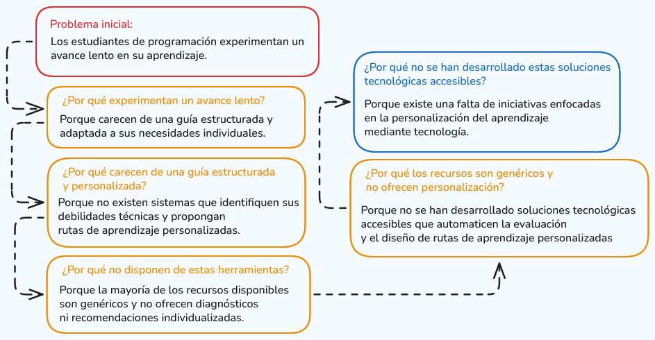
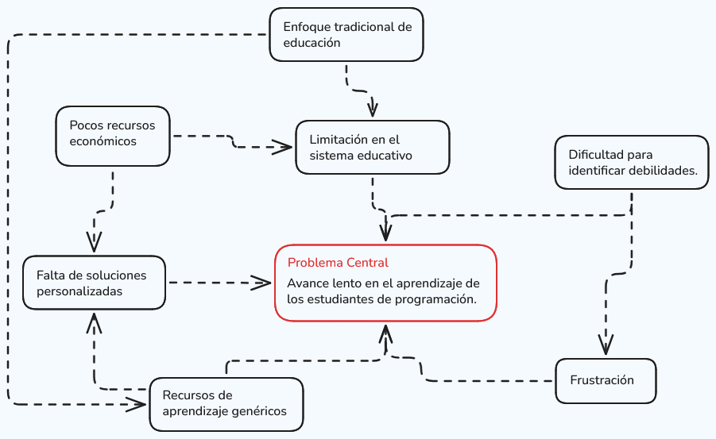
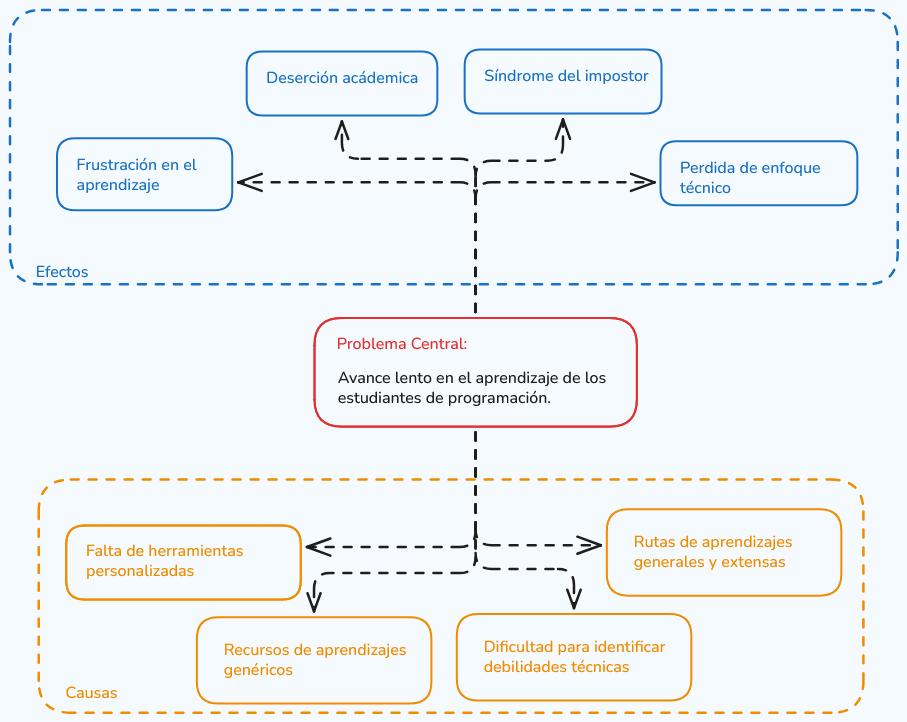

# Análisis de problema

Los estudiantes de programación experimentan un **bajo dominio de habilidades fundamentales** debido a la **ausencia de una guía estructurada y personalizada** que responda a sus necesidades individuales, lo que **limita la identificación y superación oportuna de sus debilidades técnicas**.

## Aplicación de 5 Whys al problema

- **Problema inicial**:
  Los estudiantes de programación experimentan un avance lento en su aprendizaje.

- **¿Por qué experimentan un avance lento?**
  Porque carecen de una guía estructurada y adaptada a sus necesidades individuales.

- **¿Por qué carecen de una guía estructurada y personalizada?**
  Porque no disponen de herramientas que les ayuden a identificar sus debilidades técnicas y a trazar un plan de aprendizaje personalizado.

- **¿Por qué no disponen de estas herramientas?**
  Porque la mayoría de los recursos disponibles son genéricos y no ofrecen diagnósticos ni recomendaciones individualizadas.

- **¿Por qué los recursos son genéricos y no ofrecen personalización?**
  Porque no se han desarrollado soluciones tecnológicas accesibles que automaticen la evaluación y el diseño de rutas de aprendizaje personalizadas para estudiantes de programación.

- **¿Por qué no se han desarrollado estas soluciones tecnológicas accesibles?**
  Porque existe una falta de iniciativas enfocadas en la personalización del aprendizaje mediante tecnología en el ámbito de la programación, ya sea por desconocimiento, falta de inversión o baja demanda identificada.

    

## Aplicación de Mapa del Problema

- **Problema principal**:
    Avance lento en el aprendizaje de los estudiantes de programación.

- **Causas principales y subcausas**:

  - **Falta de soluciones tecnológicas personalizadas y accesibles**
    - No existen herramientas que automaticen la evaluación de debilidades técnicas.
    - Los recursos disponibles son genéricos y no ofrecen recomendaciones individualizadas.
    - Falta de desarrollo de plataformas que generen rutas de aprendizaje personalizadas.

  - **Baja iniciativa en personalización educativa**
    - Falta de inversión o interés en el desarrollo de tecnología educativa personalizada.
    - Desconocimiento de la importancia de la personalización en el aprendizaje de programación.

  - **Consecuencias**
    - Los estudiantes no identifican sus debilidades técnicas.
    - No cuentan con un plan de aprendizaje adaptado.
    - Progreso lento y desmotivación.

    

## Aplicación del Árbol del Problema

- **Problema central**:
  Avance lento en el aprendizaje de los estudiantes de programación.

- **Causas principales**:

  - **Falta de soluciones tecnológicas personalizadas y accesibles**:
    - No existen herramientas que automaticen la evaluación de debilidades técnicas.
    - Recursos y plataformas de aprendizaje son genéricos y no adaptativos.
    - No se generan rutas de aprendizaje personalizadas.

  - **Baja iniciativa en personalización educativa**:
    - Falta de inversión o interés en tecnología educativa personalizada.
    - Desconocimiento de la importancia de la personalización.

- **Efectos principales**:

  - **Desmotivación y frustración**:
    - Los estudiantes no ven un progreso tangible en sus habilidades.
    - Las tareas o ejercicios son demasiado difíciles o demasiado fáciles.
    - Falta de apoyo o guía durante el proceso de aprendizaje.

  - **Progreso desigual y lento**:
    - Los estudiantes no logran avanzar al ritmo esperado.
    - Se genera una brecha entre el nivel actual y el nivel deseado.

  - **Deserción**:
    - Los estudiantes abandonan los cursos o programas de aprendizaje.
    - Se reduce la cantidad de profesionales capacitados en programación.

    

## Planteamiento del problema

Los estudiantes de programación experimentan un **bajo dominio de habilidades fundamentales** debido a la **ausencia de una guía estructurada y personalizada** que responda a sus necesidades individuales, lo que **limita la identificación y superación oportuna de sus debilidades técnicas**.

## Consecuencias

- **Bajo rendimiento académico**: La falta de personalización en el proceso de enseñanza impide que el estudiante identifique oportunamente los vacíos en su conocimiento, lo que repercute negativamente en su rendimiento académico.

- **Dificultad para resolver problemas**: La ausencia de identificación y fortalecimiento de las debilidades técnicas limita la capacidad del estudiante para resolver problemas complejos aplicando adecuadamente los fundamentos de programación.

- **Desmotivación y frustración**: El bajo dominio de los contenidos genera inseguridad, desinterés y frustración, lo que puede derivar en bajo compromiso académico o incluso en deserción.

- **Falta de autonomía**: La presencia de vacíos en los fundamentos de programación dificulta el desarrollo de la autonomía en el aprendizaje y en la resolución independiente de problemas.

- **Pérdida de enfoque**: Al no tener claridad sobre sus debilidades y necesidades de mejora, los estudiantes pueden perder el enfoque en sus objetivos de aprendizaje.

## Impacto

- **Impacto académico**: Se reduce la calidad del proceso formativo en el logro de competencias clave, como el pensamiento lógico, la resolución de problemas y el desarrollo de software eficiente.

- **Impacto profesional**: Los estudiantes que presentan competencias técnicas deficientes disminuyen su competitividad en el mercado laboral y enfrentan dificultades para adaptarse a los constantes cambios tecnológicos.

- **Impacto social y tecnológico**: A largo plazo, las debilidades en los fundamentos de programación pueden repercutir en la calidad de los productos tecnológicos desarrollados, afectando los niveles de innovación y eficiencia en el sector.

## Contextualización

- **¿En qué sector ocurre el problema?**: El problema se presenta en el sector educativo, específicamente en el ámbito de la formación en programación y desarrollo de software.

- **¿En qué tipo de organización?**: El problema se manifiesta en instituciones educativas que imparten formación en programación, tanto en modalidad presencial como virtual.

- **¿A qué escala?**: El problema se presenta a escala institucional, aunque puede extrapolarse a un contexto educativo más amplio, dado que la enseñanza de programación enfrenta desafíos similares en múltiples entornos formativos.

- **¿Qué actores están involucrados?**: Los principales actores involucrados son estudiantes, docentes, la institución e indirectamente el sector productivo que espera profesionales con bases técnicas solidas.

- **¿Cuál es el contexto tecnológico actual?**: En el contexto actual, donde la inteligencia artificial está transformando el desarrollo de software, el dominio de los fundamentos de programación se vuelve aún más relevante. El uso de herramientas automatizadas no sustituye el conocimiento técnico, sino que exige mayor comprensión para evaluar, modificar y optimizar el código generado, lo que incrementa la demanda de una formación sólida en competencias básicas.

## Justificación

- **¿Por qué es importante resolverlo?**: Es fundamental abordar este problema debido a que la inteligencia artificial está transformando la manera en que se desarrolla software. En el contexto actual, el rol del programador ha evolucionado de ser únicamente un generador de código a convertirse en un profesional capaz de analizar, validar, optimizar y garantizar la calidad del software producido. Por esto, para el programador es indispensable contar con fundamentos sólidos en programación, pensamiento lógico y buenas prácticas de desarrollo.

- **¿Cuál es el impacto económico, operativo o social?**: Contar con desarrolladores mejor preparados impacta positivamente en la creación de soluciones tecnológicas más seguras, eficientes e innovadoras, favoreciendo la transformación digital y el desarrollo sostenible de la sociedad.

- **¿Por qué el enfoque desde Ingeniería de Software es pertinente?**: La incorporación de herramientas basadas en inteligencia artificial permite diseñar soluciones que personalicen el proceso de aprendizaje, identifiquen debilidades técnicas y generen retroalimentación estructurada.

- **¿Qué aporta la solución frente al estado actual?**: Permite a los estudiantes identificar de manera temprana sus debilidades técnicas y recibir recomendaciones específicas para fortalecerlas. A diferencia del modelo tradicional, donde el seguimiento suele ser generalizado, la solución introduce un enfoque personalizado y apoyado en tecnología, promoviendo un aprendizaje más eficiente, autónomo y orientado a resultados.

- **Texto propuesto**: En el contexto actual de transformación digital y creciente incorporación de inteligencia artificial en el desarrollo de software, se identifica una problemática relacionada con el bajo dominio de competencias fundamentales, originada por la carencia de estrategias estructuradas y personalizadas que atiendan las necesidades individuales de los estudiantes. Esta situación limita la identificación oportuna de debilidades técnicas, afecta el rendimiento académico y genera desmotivación, pérdida de enfoque y baja autonomía en el aprendizaje. En este escenario tecnológico, fortalecer los fundamentos se vuelve imprescindible para formar profesionales capaces de evaluar, adaptar y optimizar soluciones con criterios de calidad.
